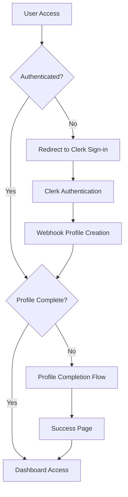

# Farm Management System - Architecture Documentation

## 🏗️ System Architecture Overview

### Technology Stack

- **Frontend**: Next.js 14 with App Router
- **Language**: TypeScript 5.7.2
- **Styling**: Tailwind CSS 3.4.17 + DaisyUI 4.12.14
- **Database**: Supabase (PostgreSQL) with Prisma ORM 6.3.0
- **Authentication**: Clerk 6.24.1
- **Forms**: React Hook Form 7.54.0 + Zod 3.24.1
- **Notifications**: Sonner 1.7.1
- **State Management**: React useState + Custom Hooks
- **Deployment**: Vercel

## 📁 Project Structure

```
jaothui-fm/
├── app/                          # Next.js App Router
│   ├── api/                      # API Routes
│   │   ├── activities/           # Activity CRUD endpoints
│   │   ├── animals/              # Animal CRUD endpoints
│   │   ├── farms/                # Farm management endpoints
│   │   └── webhooks/             # Clerk webhooks
│   ├── dashboard/                # Protected dashboard pages
│   │   └── animals/              # Animal management pages
│   ├── profile/                  # Profile completion flow
│   ├── globals.css               # Global styles
│   ├── layout.tsx                # Root layout with providers
│   └── page.tsx                  # Home page
├── components/                   # Reusable UI components
│   ├── forms/                    # Form components
│   └── ui/                       # Basic UI components
├── lib/                          # Utility libraries
│   ├── activity-utils.ts         # Activity management utilities
│   ├── animal-id.ts              # Animal ID generation
│   ├── auth.ts                   # Authentication utilities
│   ├── form-utils.ts             # Form validation helpers
│   ├── prisma.ts                 # Database client
│   ├── types.ts                  # TypeScript type definitions
│   ├── user.ts                   # User management utilities
│   └── validations.ts            # Zod validation schemas
├── mock-ui/                      # UI design specifications (JSON)
├── prisma/                       # Database schema and migrations
├── public/                       # Static assets
├── middleware.ts                 # Clerk authentication middleware
└── Documentation files
```

## 🧩 Component Architecture

### Design System Hierarchy

```
Theme Provider (DaisyUI)
├── Layout Components
│   ├── Header Component
│   ├── Navigation Components
│   └── Footer Component
├── Page Components
│   ├── List Pages (Animal Lists)
│   ├── Detail Pages (Animal Details)
│   └── Form Pages (Add/Edit)
├── Feature Components
│   ├── Animal Management
│   ├── Activity Management
│   └── Form Components
└── UI Components
    ├── Cards (Buffalo Card Pattern)
    ├── Buttons
    ├── Inputs
    └── Modals
```

### Component Patterns

#### 1. Buffalo Card Pattern (Standard Design)

```tsx
// Design specifications from animal-list-tab-page.json
interface BuffaloCardProps {
  image?: string;
  title: string;
  subtitle?: string;
  id: string;
  onClick?: () => void;
}

// Standard styling:
// - Background: #f9f9f9
// - Border radius: 15px
// - Padding: 15px
// - Margin bottom: 15px
// - Display: flex
// - Align items: center
```

#### 2. Activity History Card (Extension of Buffalo Card)

```tsx
// Follows buffalo_card pattern exactly
interface ActivityHistoryCardProps {
  activity: {
    id: string;
    title: string;
    description?: string;
    activityDate: Date;
    status: ActivityStatus;
    reminderDate?: Date;
  };
}

// Design adaptations:
// - Activity type icon (left side)
// - Main content (center)
// - Status indicator (right side)
// - Same styling as buffalo_card
```

#### 3. Form Component Pattern

```tsx
// Standard form structure using React Hook Form + Zod
interface FormComponentProps<T> {
  onSubmit: (data: T) => void;
  defaultValues?: Partial<T>;
  isLoading?: boolean;
}

// Implementation pattern:
// - useForm with zodResolver
// - Error handling with toast notifications
// - Loading states with disabled inputs
// - Mobile-responsive design
```

### State Management Strategy

#### 1. Local Component State

```tsx
// Simple component state with useState
const [isOpen, setIsOpen] = useState(false);
const [loading, setLoading] = useState(false);
```

#### 2. Form State Management

```tsx
// React Hook Form for complex forms
const {
  register,
  handleSubmit,
  formState: { errors, isSubmitting },
  setValue,
  watch
} = useForm<FormData>({
  resolver: zodResolver(validationSchema)
});
```

#### 3. Server State Management

```tsx
// Custom hooks for API data fetching
export function useApiData<T>(url: string) {
  const [data, setData] = useState<T | null>(null);
  const [loading, setLoading] = useState(true);
  const [error, setError] = useState<Error | null>(null);
  
  // Fetch logic with error handling
  return { data, loading, error, refetch };
}
```

#### 4. localStorage Management

```tsx
// Activity type history management
export function useActivityTypes() {
  const [types, setTypes] = useState<string[]>([]);
  
  useEffect(() => {
    const savedTypes = localStorage.getItem('activityTypes');
    if (savedTypes) {
      setTypes(JSON.parse(savedTypes));
    }
  }, []);
  
  const addType = (type: string) => {
    const updatedTypes = [...new Set([type, ...types])];
    setTypes(updatedTypes);
    localStorage.setItem('activityTypes', JSON.stringify(updatedTypes));
  };
  
  return { types, addType };
}
```

## 🎨 Design System Integration

### Color Palette Implementation

```tsx
// Primary colors from UI-GUIDELINES.md
const theme = {
  primary: '#f39c12',        // Orange brand color
  primaryLight: '#f5b041',   // Lighter orange for hover
  primaryDark: '#d68910',    // Darker orange for active
  
  neutral: {
    headerBg: '#4a4a4a',     // Dark gray header
    textPrimary: '#333333',   // Main text color
    textSecondary: '#666666', // Secondary text
    textMuted: '#999999',     // Muted text
  },
  
  background: {
    white: '#ffffff',         // Pure white
    light: '#f9f9f9',        // Light gray cards
    input: '#f5f5f5',        // Input backgrounds
    border: '#e0e0e0',       // Border color
  },
  
  status: {
    success: '#2ecc71',       // Green for success
    warning: '#f1c40f',       // Yellow for warning
    error: '#e74c3c',         // Red for error
    info: '#3498db',          // Blue for info
  }
};
```

### Typography System

```tsx
// Font sizes and weights from UI-GUIDELINES.md
const typography = {
  fontSize: {
    xs: '12px',    // Small labels
    sm: '14px',    // Secondary text
    base: '16px',  // Body text
    lg: '18px',    // Large text
    xl: '20px',    // Subheadings
    '2xl': '24px', // Headings
    '3xl': '32px', // Brand text
  },
  
  fontWeight: {
    normal: 400,
    medium: 500,
    semibold: 600,
    bold: 700,
  },
  
  lineHeight: {
    tight: 1.25,
    normal: 1.5,
    relaxed: 1.75,
  }
};
```

### Spacing System

```tsx
// Spacing scale from UI-GUIDELINES.md
const spacing = {
  1: '4px',    // 0.25rem
  2: '8px',    // 0.5rem
  3: '12px',   // 0.75rem
  4: '16px',   // 1rem
  5: '20px',   // 1.25rem
  6: '24px',   // 1.5rem
  8: '32px',   // 2rem
  10: '40px',  // 2.5rem
  12: '48px',  // 3rem
  16: '64px',  // 4rem
  20: '80px',  // 5rem
};
```

## 📱 Responsive Design Architecture

### Mobile-First Approach

```tsx
// Base mobile styles (400px max-width)
const mobileFirst = {
  container: {
    maxWidth: '400px',
    margin: '0 auto',
    padding: '0 20px',
  },
  
  // Desktop enhancements
  desktop: {
    maxWidth: '768px',
    padding: '0 40px',
  }
};
```

### Touch Target Guidelines

```tsx
// Minimum touch targets for mobile
const touchTargets = {
  minHeight: '44px',    // Minimum button height
  minWidth: '44px',     // Minimum interactive area
  spacing: '8px',       // Minimum spacing between targets
};
```

### Breakpoint Strategy

```tsx
// Responsive breakpoints
const breakpoints = {
  mobile: '400px',      // Primary mobile target
  tablet: '768px',      // Tablet landscape
  desktop: '1024px',    // Desktop
};
```

## 🔧 API Architecture

### Route Structure

```
/api/
├── farms/              # Farm management
│   └── route.ts        # GET, POST /api/farms
├── animals/            # Animal management
│   ├── route.ts        # GET, POST /api/animals
│   ├── [id]/
│   │   └── route.ts    # GET, PUT, DELETE /api/animals/[id]
│   └── generate-id/
│       └── route.ts    # GET /api/animals/generate-id
├── activities/         # Activity management
│   ├── route.ts        # GET, POST /api/activities
│   └── [id]/
│       ├── route.ts    # GET, PUT, DELETE /api/activities/[id]
│       └── status/
│           └── route.ts # PATCH /api/activities/[id]/status
└── webhooks/
    └── clerk/
        └── route.ts    # POST /api/webhooks/clerk
```

### Authentication Pattern

```tsx
// Standard API route authentication
import { auth } from '@clerk/nextjs';

export async function GET() {
  const { userId } = auth();
  
  if (!userId) {
    return NextResponse.json(
      { error: 'Unauthorized' },
      { status: 401 }
    );
  }
  
  // Route logic
}
```

### Error Handling Pattern

```tsx
// Consistent error handling across API routes
try {
  // API logic
  return NextResponse.json({ data: result });
} catch (error) {
  console.error('API Error:', error);
  return NextResponse.json(
    { error: 'Internal Server Error' },
    { status: 500 }
  );
}
```

### Validation Pattern

```tsx
// Request validation with Zod
import { validationSchema } from '@/lib/validations';

export async function POST(request: Request) {
  try {
    const body = await request.json();
    const validatedData = validationSchema.parse(body);
    
    // Process validated data
  } catch (error) {
    if (error instanceof z.ZodError) {
      return NextResponse.json(
        { error: 'Validation failed', details: error.errors },
        { status: 400 }
      );
    }
  }
}
```

## 🗄️ Database Architecture

### Prisma Schema Structure

```prisma
// Core models with relationships
model Profile {
  id          String @id @default(dbgenerated("gen_random_uuid()"))
  clerkUserId String @unique
  phoneNumber String @unique
  firstName   String
  lastName    String
  ownedFarms  Farm[] @relation("FarmOwner")
}

model Farm {
  id       String @id @default(dbgenerated("gen_random_uuid()"))
  ownerId  String
  farmName String @default("ฟาร์มของฉัน")
  province String @default("ไม่ระบุ")
  owner    Profile @relation("FarmOwner", fields: [ownerId], references: [id])
  animals  Animal[]
}

model Animal {
  id         String     @id @default(dbgenerated("gen_random_uuid()"))
  farmId     String
  animalId   String     // Auto-generated or manual
  animalType AnimalType // BUFFALO, CHICKEN, COW, PIG, HORSE
  name       String     // Required
  sex        Sex?       // Optional
  birthDate  DateTime?  // Optional
  color      String?    // Optional
  weightKg   Int?       // Optional
  heightCm   Int?       // Optional
  motherName String?    // Optional
  fatherName String?    // Optional
  imageUrl   String?    // Optional
  farm       Farm @relation(fields: [farmId], references: [id])
  activities Activity[]
  @@unique([farmId, animalId])
}

model Activity {
  id           String         @id @default(dbgenerated("gen_random_uuid()"))
  animalId     String
  farmId       String
  title        String
  description  String?
  activityDate DateTime
  reminderDate DateTime?      // Optional - creates reminder if exists
  status       ActivityStatus @default(PENDING)
  animal       Animal @relation(fields: [animalId], references: [id])
}
```

### Business Logic Implementation

```tsx
// Animal ID generation business logic
export function generateAnimalId(animalType: AnimalType, date: Date): string {
  const typeCodes = {
    BUFFALO: 'BF',
    CHICKEN: 'CK',
    COW: 'CW',
    PIG: 'PG',
    HORSE: 'HR'
  };
  
  const dateStr = format(date, 'yyyyMMdd');
  const sequence = '001'; // Generated based on existing animals
  
  return `${typeCodes[animalType]}${dateStr}${sequence}`;
}
```

## 🔒 Security Architecture

### Authentication Flow



### Route Protection

```tsx
// Middleware protection pattern
import { clerkMiddleware, createRouteMatcher } from '@clerk/nextjs/server';

const isProtectedRoute = createRouteMatcher([
  '/dashboard(.*)',
  '/profile(.*)'
]);

export default clerkMiddleware((auth, req) => {
  if (isProtectedRoute(req)) auth().protect();
});
```

### Data Access Control

```tsx
// Farm-based access control
export async function getUserFarm(userId: string) {
  const profile = await prisma.profile.findUnique({
    where: { clerkUserId: userId },
    include: { ownedFarms: true }
  });
  
  if (!profile || profile.ownedFarms.length === 0) {
    throw new Error('Farm not found');
  }
  
  return profile.ownedFarms[0];
}
```

## 📊 Performance Architecture

### Optimization Strategies

1. **Component Optimization**
   ```tsx
   // Memoization for expensive components
   const AnimalCard = React.memo(({ animal }: AnimalCardProps) => {
     return <div>{/* Component content */}</div>;
   });
   ```

2. **Data Fetching Optimization**
   ```tsx
   // Efficient data fetching with proper error handling
   export async function getAnimalsWithActivities(farmId: string) {
     return prisma.animal.findMany({
       where: { farmId },
       include: {
         activities: {
           orderBy: { activityDate: 'desc' },
           take: 5 // Limit initial load
         }
       }
     });
   }
   ```

3. **Image Optimization**
   ```tsx
   // Conditional rendering for images vs placeholders
   const AnimalImage = ({ imageUrl, animalType, name }: ImageProps) => {
     if (imageUrl) {
       return ;
     }
     
     return (
       <div className="animal-placeholder">
         <span className="animal-icon">{getAnimalTypeIcon(animalType)}</span>
         <span className="animal-name">{name}</span>
       </div>
     );
   };
   ```

### Bundle Optimization

```tsx
// Dynamic imports for code splitting
const ActivityForm = dynamic(() => import('@/components/forms/activity-form'), {
  loading: () => <div>Loading...</div>
});
```

## 🧪 Testing Architecture

### Component Testing Strategy

```tsx
// Standard component test pattern
import { render, screen, fireEvent } from '@testing-library/react';
import { AnimalCard } from './animal-card';

describe('AnimalCard', () => {
  const mockAnimal = {
    id: '1',
    name: 'Test Buffalo',
    animalType: 'BUFFALO',
    animalId: 'BF20250101001'
  };
  
  it('renders animal information correctly', () => {
    render(<AnimalCard animal={mockAnimal} />);
    expect(screen.getByText('Test Buffalo')).toBeInTheDocument();
    expect(screen.getByText('BF20250101001')).toBeInTheDocument();
  });
  
  it('handles click events', () => {
    const onClickMock = jest.fn();
    render(<AnimalCard animal={mockAnimal} onClick={onClickMock} />);
    fireEvent.click(screen.getByRole('button'));
    expect(onClickMock).toHaveBeenCalledWith('1');
  });
});
```

### API Testing Strategy

```tsx
// API route testing pattern
import { createMocks } from 'node-mocks-http';
import handler from '@/app/api/animals/route';

describe('/api/animals', () => {
  it('handles GET request successfully', async () => {
    const { req, res } = createMocks({
      method: 'GET',
      headers: { authorization: 'Bearer valid-token' }
    });
    
    await handler(req, res);
    
    expect(res._getStatusCode()).toBe(200);
    expect(JSON.parse(res._getData())).toHaveProperty('data');
  });
});
```

## 📋 Development Workflow

### Feature Development Process

1. **Planning Phase**
   - Define component requirements
   - Review UI-GUIDELINES.md patterns
   - Plan API endpoints if needed

2. **Implementation Phase**
   - Create components following established patterns
   - Implement API routes with proper validation
   - Add TypeScript types

3. **Testing Phase**
   - Write component tests
   - Test API endpoints
   - Manual mobile testing (400px width)

4. **Integration Phase**
   - Integrate with existing pages
   - Test user flows end-to-end
   - Verify mobile responsiveness

5. **Review Phase**
   - Code review against architecture patterns
   - Performance optimization if needed
   - Documentation updates

### Code Quality Standards

```tsx
// Standard imports organization
import React from 'react';                    // React imports
import { useState, useEffect } from 'react';  // React hooks
import { NextResponse } from 'next/server';   // Next.js imports
import { z } from 'zod';                      // Third-party imports
import { AnimalType } from '@prisma/client';  // Generated types
import { validateAnimalId } from '@/lib/animal-id';  // Local utilities
import type { ApiResponse } from '@/lib/types';      // Local types
```

```tsx
// Component naming conventions
// - PascalCase for components
// - camelCase for functions and variables
// - SCREAMING_SNAKE_CASE for constants
// - kebab-case for file names

const ANIMAL_TYPE_ICONS = {
  BUFFALO: '🐃',
  CHICKEN: '🐔'
} as const;

export function AnimalCard({ animal }: AnimalCardProps) {
  const handleClick = () => {
    // Implementation
  };
  
  return <div>{/* Component content */}</div>;
}
```

## 🔮 Future Architecture Considerations

### Scalability Improvements

1. **State Management Evolution**
   ```tsx
   // Potential future: Context API for global state
   const FarmContext = createContext<FarmContextType>();
   
   // Or React Query for server state
   const { data: animals } = useQuery(['animals', farmId], fetchAnimals);
   ```

2. **Component Library Extraction**
   ```tsx
   // Potential future: Separate UI component library
   import { Card, Button, Input } from '@jaothui/ui-components';
   ```

3. **Database Optimization**
   ```prisma
   // Future: Database indexes for performance
   model Animal {
     // ... existing fields
     @@index([farmId, animalType])
     @@index([farmId, createdAt])
   }
   ```

### Performance Monitoring

```tsx
// Future: Performance monitoring integration
import { reportWebVitals } from 'web-vitals';

reportWebVitals((metric) => {
  // Send to analytics service
  console.log(metric);
});
```

---

**Last Updated**: 2025-07-11 (Round 7.1 Documentation Enhancement)
**Next Review**: After Round 7.2 Activity History Enhancement completion