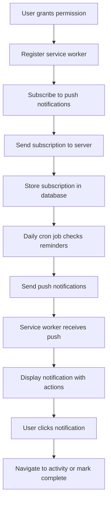

# Farm Management System - Architecture Documentation

## 🏗️ System Architecture Overview

### Technology Stack

- **Frontend**: Next.js 14 with App Router
- **Language**: TypeScript 5.7.2
- **Styling**: Tailwind CSS 3.4.17 + DaisyUI 4.12.14
- **Database**: Supabase (PostgreSQL) with Prisma ORM 6.3.0
- **Authentication**: Clerk 6.24.1
- **Forms**: React Hook Form 7.54.0 + Zod 3.24.1
- **Notifications**: Sonner 1.7.1 + Web Push Notifications
- **Push Notifications**: web-push library with VAPID keys ✅
- **Cron Jobs**: Vercel Cron for daily scheduling ✅
- **State Management**: React useState + Custom Hooks
- **Deployment**: Vercel + Service Worker support

## 📁 Project Structure

```
jaothui-fm/
├── app/                          # Next.js App Router
│   ├── api/                      # API Routes
│   │   ├── activities/           # Activity CRUD endpoints
│   │   ├── animals/              # Animal CRUD endpoints
│   │   ├── farms/                # Farm management endpoints
│   │   ├── notifications/        # Notification system APIs ✅
│   │   ├── cron/
│   │   │   └── reminders/        # Daily cron job for notifications ✅
│   │   └── webhooks/             # Clerk webhooks
│   ├── dashboard/                # Protected dashboard pages
│   │   ├── activities/           # Activity management pages ✅
│   │   └── animals/              # Animal management pages
│   │       └── [id]/
│   │           └── activities/   # Animal-specific activity list page (Round 7.4)
│   ├── profile/                  # Profile completion flow
│   ├── globals.css               # Global styles
│   ├── layout.tsx                # Root layout with providers
│   └── page.tsx                  # Home page
├── components/                   # Reusable UI components
│   ├── forms/                    # Form components
│   └── ui/                       # Basic UI components
│       └── notification-bell.tsx # Notification bell component ✅
├── lib/                          # Utility libraries
│   ├── activity-utils.ts         # Activity management utilities
│   ├── animal-id.ts              # Animal ID generation
│   ├── auth.ts                   # Authentication utilities
│   ├── form-utils.ts             # Form validation helpers
│   ├── notification-client-utils.ts # Client-side notification utilities ✅
│   ├── prisma.ts                 # Database client
│   ├── types.ts                  # TypeScript type definitions
│   ├── user.ts                   # User management utilities
│   ├── validations.ts            # Zod validation schemas
│   └── web-push-utils.ts         # Server-side push notification utilities ✅
├── mock-ui/                      # UI design specifications (JSON)
├── prisma/                       # Database schema and migrations
├── public/                       # Static assets
│   └── service-worker.js         # Service worker for push notifications ✅
├── middleware.ts                 # Clerk authentication middleware (updated for SW)
├── vercel.json                   # Vercel deployment and cron configuration ✅
└── Documentation files
```

## 🧩 Component Architecture

### Design System Hierarchy

```
Theme Provider (DaisyUI)
├── Layout Components
│   ├── Header Component
│   ├── Navigation Components
│   └── Footer Component
├── Page Components
│   ├── List Pages (Animal Lists)
│   ├── Detail Pages (Animal Details)
│   └── Form Pages (Add/Edit)
├── Feature Components
│   ├── Animal Management
│   ├── Activity Management
│   └── Form Components
└── UI Components
    ├── Cards (Buffalo Card Pattern)
    ├── Buttons
    ├── Inputs
    └── Modals
```

### Component Patterns

#### 1. Buffalo Card Pattern (Standard Design)

```tsx
// Design specifications from animal-list-tab-page.json
interface BuffaloCardProps {
  image?: string;
  title: string;
  subtitle?: string;
  id: string;
  onClick?: () => void;
}

// Standard styling:
// - Background: #f9f9f9
// - Border radius: 15px
// - Padding: 15px
// - Margin bottom: 15px
// - Display: flex
// - Align items: center
```

#### 2. Activity History Card (Extension of Buffalo Card)

```tsx
// Follows buffalo_card pattern exactly
interface ActivityHistoryCardProps {
  activity: {
    id: string;
    title: string;
    description?: string;
    activityDate: Date;
    status: ActivityStatus;
    reminderDate?: Date;
  };
}

// Design adaptations:
// - Activity type icon (left side)
// - Main content (center)
// - Status indicator (right side)
// - Same styling as buffalo_card
```

#### 3. Form Component Pattern

```tsx
// Standard form structure using React Hook Form + Zod
interface FormComponentProps<T> {
  onSubmit: (data: T) => void;
  defaultValues?: Partial<T>;
  isLoading?: boolean;
}

// Implementation pattern:
// - useForm with zodResolver
// - Error handling with toast notifications
// - Loading states with disabled inputs
// - Mobile-responsive design
```

### State Management Strategy

#### 1. Local Component State

```tsx
// Simple component state with useState
const [isOpen, setIsOpen] = useState(false);
const [loading, setLoading] = useState(false);
```

#### 2. Form State Management

```tsx
// React Hook Form for complex forms
const {
  register,
  handleSubmit,
  formState: { errors, isSubmitting },
  setValue,
  watch,
} = useForm<FormData>({
  resolver: zodResolver(validationSchema),
});
```

#### 3. Server State Management

```tsx
// Custom hooks for API data fetching
export function useApiData<T>(url: string) {
  const [data, setData] = useState<T | null>(null);
  const [loading, setLoading] = useState(true);
  const [error, setError] = useState<Error | null>(null);

  // Fetch logic with error handling
  return { data, loading, error, refetch };
}
```

#### 4. localStorage Management

```tsx
// Activity type history management
export function useActivityTypes() {
  const [types, setTypes] = useState<string[]>([]);

  useEffect(() => {
    const savedTypes = localStorage.getItem("activityTypes");
    if (savedTypes) {
      setTypes(JSON.parse(savedTypes));
    }
  }, []);

  const addType = (type: string) => {
    const updatedTypes = [...new Set([type, ...types])];
    setTypes(updatedTypes);
    localStorage.setItem("activityTypes", JSON.stringify(updatedTypes));
  };

  return { types, addType };
}
```

## 🎨 Design System Integration

### Color Palette Implementation

```tsx
// Primary colors from UI-GUIDELINES.md
const theme = {
  primary: "#f39c12", // Orange brand color
  primaryLight: "#f5b041", // Lighter orange for hover
  primaryDark: "#d68910", // Darker orange for active

  neutral: {
    headerBg: "#4a4a4a", // Dark gray header
    textPrimary: "#333333", // Main text color
    textSecondary: "#666666", // Secondary text
    textMuted: "#999999", // Muted text
  },

  background: {
    white: "#ffffff", // Pure white
    light: "#f9f9f9", // Light gray cards
    input: "#f5f5f5", // Input backgrounds
    border: "#e0e0e0", // Border color
  },

  status: {
    success: "#2ecc71", // Green for success
    warning: "#f1c40f", // Yellow for warning
    error: "#e74c3c", // Red for error
    info: "#3498db", // Blue for info
  },
};
```

### Typography System

```tsx
// Font sizes and weights from UI-GUIDELINES.md
const typography = {
  fontSize: {
    xs: "12px", // Small labels
    sm: "14px", // Secondary text
    base: "16px", // Body text
    lg: "18px", // Large text
    xl: "20px", // Subheadings
    "2xl": "24px", // Headings
    "3xl": "32px", // Brand text
  },

  fontWeight: {
    normal: 400,
    medium: 500,
    semibold: 600,
    bold: 700,
  },

  lineHeight: {
    tight: 1.25,
    normal: 1.5,
    relaxed: 1.75,
  },
};
```

### Spacing System

```tsx
// Spacing scale from UI-GUIDELINES.md
const spacing = {
  1: "4px", // 0.25rem
  2: "8px", // 0.5rem
  3: "12px", // 0.75rem
  4: "16px", // 1rem
  5: "20px", // 1.25rem
  6: "24px", // 1.5rem
  8: "32px", // 2rem
  10: "40px", // 2.5rem
  12: "48px", // 3rem
  16: "64px", // 4rem
  20: "80px", // 5rem
};
```

## 📱 Responsive Design Architecture

### Mobile-First Approach

```tsx
// Base mobile styles (400px max-width)
const mobileFirst = {
  container: {
    maxWidth: "400px",
    margin: "0 auto",
    padding: "0 20px",
  },

  // Desktop enhancements
  desktop: {
    maxWidth: "768px",
    padding: "0 40px",
  },
};
```

### Touch Target Guidelines

```tsx
// Minimum touch targets for mobile
const touchTargets = {
  minHeight: "44px", // Minimum button height
  minWidth: "44px", // Minimum interactive area
  spacing: "8px", // Minimum spacing between targets
};
```

### Breakpoint Strategy

```tsx
// Responsive breakpoints
const breakpoints = {
  mobile: "400px", // Primary mobile target
  tablet: "768px", // Tablet landscape
  desktop: "1024px", // Desktop
};
```

## 🔧 API Architecture

### Route Structure

```
/api/
├── farms/              # Farm management
│   └── route.ts        # GET, POST /api/farms
├── animals/            # Animal management
│   ├── route.ts        # GET, POST /api/animals
│   ├── [id]/
│   │   └── route.ts    # GET, PUT, DELETE /api/animals/[id]
│   └── generate-id/
│       └── route.ts    # GET /api/animals/generate-id
├── activities/         # Activity management ✅
│   ├── route.ts        # GET, POST /api/activities (with status support)
│   └── [id]/
│       ├── route.ts    # GET, PUT, DELETE /api/activities/[id]
│       └── status/
│           └── route.ts # PATCH /api/activities/[id]/status
└── webhooks/
    └── clerk/
        └── route.ts    # POST /api/webhooks/clerk
```

### Authentication Pattern

```tsx
// Standard API route authentication
import { auth } from "@clerk/nextjs";

export async function GET() {
  const { userId } = auth();

  if (!userId) {
    return NextResponse.json({ error: "Unauthorized" }, { status: 401 });
  }

  // Route logic
}
```

### Error Handling Pattern

```tsx
// Consistent error handling across API routes
try {
  // API logic
  return NextResponse.json({ data: result });
} catch (error) {
  console.error("API Error:", error);
  return NextResponse.json({ error: "Internal Server Error" }, { status: 500 });
}
```

### Validation Pattern

```tsx
// Request validation with Zod
import { validationSchema } from "@/lib/validations";

export async function POST(request: Request) {
  try {
    const body = await request.json();
    const validatedData = validationSchema.parse(body);

    // Process validated data
  } catch (error) {
    if (error instanceof z.ZodError) {
      return NextResponse.json(
        { error: "Validation failed", details: error.errors },
        { status: 400 }
      );
    }
  }
}
```

## 🗄️ Database Architecture

### Prisma Schema Structure

```prisma
// Core models with relationships
model Profile {
  id          String @id @default(dbgenerated("gen_random_uuid()"))
  clerkUserId String @unique
  phoneNumber String @unique
  firstName   String
  lastName    String
  ownedFarms  Farm[] @relation("FarmOwner")
}

model Farm {
  id       String @id @default(dbgenerated("gen_random_uuid()"))
  ownerId  String
  farmName String @default("ฟาร์มของฉัน")
  province String @default("ไม่ระบุ")
  owner    Profile @relation("FarmOwner", fields: [ownerId], references: [id])
  animals  Animal[]
}

model Animal {
  id         String     @id @default(dbgenerated("gen_random_uuid()"))
  farmId     String
  animalId   String     // Auto-generated or manual
  animalType AnimalType // BUFFALO, CHICKEN, COW, PIG, HORSE
  name       String     // Required
  sex        Sex?       // Optional
  birthDate  DateTime?  // Optional
  color      String?    // Optional
  weightKg   Int?       // Optional
  heightCm   Int?       // Optional
  motherName String?    // Optional
  fatherName String?    // Optional
  imageUrl   String?    // Optional
  farm       Farm @relation(fields: [farmId], references: [id])
  activities Activity[]
  @@unique([farmId, animalId])
}

model Activity {
  id           String         @id @default(dbgenerated("gen_random_uuid()"))
  animalId     String
  farmId       String
  title        String
  description  String?
  activityDate DateTime
  reminderDate DateTime?      // Optional - creates reminder if exists
  status       ActivityStatus @default(PENDING)
  animal       Animal @relation(fields: [animalId], references: [id])
}
```

### Business Logic Implementation

```tsx
// Animal ID generation business logic
export function generateAnimalId(animalType: AnimalType, date: Date): string {
  const typeCodes = {
    BUFFALO: "BF",
    CHICKEN: "CK",
    COW: "CW",
    PIG: "PG",
    HORSE: "HR",
  };

  const dateStr = format(date, "yyyyMMdd");
  const sequence = "001"; // Generated based on existing animals

  return `${typeCodes[animalType]}${dateStr}${sequence}`;
}
```

## 🔒 Security Architecture

### Authentication Flow


### Route Protection

```tsx
// Middleware protection pattern
import { clerkMiddleware, createRouteMatcher } from "@clerk/nextjs/server";

const isProtectedRoute = createRouteMatcher(["/dashboard(.*)", "/profile(.*)"]);

export default clerkMiddleware((auth, req) => {
  if (isProtectedRoute(req)) auth().protect();
});
```

### Data Access Control

```tsx
// Farm-based access control
export async function getUserFarm(userId: string) {
  const profile = await prisma.profile.findUnique({
    where: { clerkUserId: userId },
    include: { ownedFarms: true },
  });

  if (!profile || profile.ownedFarms.length === 0) {
    throw new Error("Farm not found");
  }

  return profile.ownedFarms[0];
}
```

## 📊 Performance Architecture

### Optimization Strategies

1. **Component Optimization**

   ```tsx
   // Memoization for expensive components
   const AnimalCard = React.memo(({ animal }: AnimalCardProps) => {
     return <div>{/* Component content */}</div>;
   });
   ```

2. **Data Fetching Optimization**

   ```tsx
   // Efficient data fetching with proper error handling
   export async function getAnimalsWithActivities(farmId: string) {
     return prisma.animal.findMany({
       where: { farmId },
       include: {
         activities: {
           orderBy: { activityDate: "desc" },
           take: 5, // Limit initial load
         },
       },
     });
   }
   ```

3. **Image Optimization**
   ```tsx
   // Conditional rendering for images vs placeholders
   const AnimalImage = ({ imageUrl, animalType, name }: ImageProps) => {
     if (imageUrl) {
       return ;
     }

     return (
       <div className="animal-placeholder">
         <span className="animal-icon">{getAnimalTypeIcon(animalType)}</span>
         <span className="animal-name">{name}</span>
       </div>
     );
   };
   ```

### Bundle Optimization

```tsx
// Dynamic imports for code splitting
const ActivityForm = dynamic(() => import("@/components/forms/activity-form"), {
  loading: () => <div>Loading...</div>,
});
```

## 🧪 Testing Architecture

### Component Testing Strategy

```tsx
// Standard component test pattern
import { render, screen, fireEvent } from "@testing-library/react";
import { AnimalCard } from "./animal-card";

describe("AnimalCard", () => {
  const mockAnimal = {
    id: "1",
    name: "Test Buffalo",
    animalType: "BUFFALO",
    animalId: "BF20250101001",
  };

  it("renders animal information correctly", () => {
    render(<AnimalCard animal={mockAnimal} />);
    expect(screen.getByText("Test Buffalo")).toBeInTheDocument();
    expect(screen.getByText("BF20250101001")).toBeInTheDocument();
  });

  it("handles click events", () => {
    const onClickMock = jest.fn();
    render(<AnimalCard animal={mockAnimal} onClick={onClickMock} />);
    fireEvent.click(screen.getByRole("button"));
    expect(onClickMock).toHaveBeenCalledWith("1");
  });
});
```

### API Testing Strategy

```tsx
// API route testing pattern
import { createMocks } from "node-mocks-http";
import handler from "@/app/api/animals/route";

describe("/api/animals", () => {
  it("handles GET request successfully", async () => {
    const { req, res } = createMocks({
      method: "GET",
      headers: { authorization: "Bearer valid-token" },
    });

    await handler(req, res);

    expect(res._getStatusCode()).toBe(200);
    expect(JSON.parse(res._getData())).toHaveProperty("data");
  });
});
```

## 📋 Development Workflow

### Feature Development Process

1. **Planning Phase**

   - Define component requirements
   - Review UI-GUIDELINES.md patterns
   - Plan API endpoints if needed

2. **Implementation Phase**

   - Create components following established patterns
   - Implement API routes with proper validation
   - Add TypeScript types

3. **Testing Phase**

   - Write component tests
   - Test API endpoints
   - Manual mobile testing (400px width)

4. **Integration Phase**

   - Integrate with existing pages
   - Test user flows end-to-end
   - Verify mobile responsiveness

5. **Review Phase**
   - Code review against architecture patterns
   - Performance optimization if needed
   - Documentation updates

### Code Quality Standards

```tsx
// Standard imports organization
import React from "react"; // React imports
import { useState, useEffect } from "react"; // React hooks
import { NextResponse } from "next/server"; // Next.js imports
import { z } from "zod"; // Third-party imports
import { AnimalType } from "@prisma/client"; // Generated types
import { validateAnimalId } from "@/lib/animal-id"; // Local utilities
import type { ApiResponse } from "@/lib/types"; // Local types
```

```tsx
// Component naming conventions
// - PascalCase for components
// - camelCase for functions and variables
// - SCREAMING_SNAKE_CASE for constants
// - kebab-case for file names

const ANIMAL_TYPE_ICONS = {
  BUFFALO: "🐃",
  CHICKEN: "🐔",
} as const;

export function AnimalCard({ animal }: AnimalCardProps) {
  const handleClick = () => {
    // Implementation
  };

  return <div>{/* Component content */}</div>;
}
```

## 🔮 Future Architecture Considerations

### Scalability Improvements

1. **State Management Evolution**

   ```tsx
   // Potential future: Context API for global state
   const FarmContext = createContext<FarmContextType>();

   // Or React Query for server state
   const { data: animals } = useQuery(["animals", farmId], fetchAnimals);
   ```

2. **Component Library Extraction**

   ```tsx
   // Potential future: Separate UI component library
   import { Card, Button, Input } from "@jaothui/ui-components";
   ```

3. **Database Optimization**
   ```prisma
   // Future: Database indexes for performance
   model Animal {
     // ... existing fields
     @@index([farmId, animalType])
     @@index([farmId, createdAt])
   }
   ```

### Performance Monitoring

```tsx
// Future: Performance monitoring integration
import { reportWebVitals } from "web-vitals";

reportWebVitals((metric) => {
  // Send to analytics service
  console.log(metric);
});
```

---

## 🔔 Notification System Architecture (Round 8 ✅)

### Service Worker Integration

```javascript
// public/service-worker.js - Push notification handling
self.addEventListener('push', function(event) {
  if (event.data) {
    const data = event.data.json();
    
    const options = {
      body: data.body,
      icon: data.icon || '/jaothui-logo.png',
      badge: '/badge-icon.png',
      tag: data.tag || 'farm-reminder',
      data: data.data,
      actions: [
        {
          action: 'view',
          title: 'ดูรายละเอียด',
          icon: '/icons/view.png'
        },
        {
          action: 'complete',
          title: 'ทำเสร็จแล้ว',
          icon: '/icons/complete.png'
        }
      ],
      requireInteraction: true
    };
    
    event.waitUntil(
      self.registration.showNotification(data.title, options)
    );
  }
});

self.addEventListener('notificationclick', function(event) {
  event.notification.close();
  
  if (event.action === 'view') {
    event.waitUntil(
      clients.openWindow(event.notification.data.url)
    );
  } else if (event.action === 'complete') {
    // Handle complete action via API
    fetch(`/api/activities/${event.notification.data.activityId}/status`, {
      method: 'PATCH',
      headers: { 'Content-Type': 'application/json' },
      body: JSON.stringify({ status: 'COMPLETED' })
    });
  } else {
    // Default click action
    event.waitUntil(
      clients.openWindow(event.notification.data.url || '/')
    );
  }
});
```

### Web Push Notification Flow



### VAPID Configuration

```typescript
// lib/web-push-utils.ts - Server-side push utilities
import webpush from 'web-push';

webpush.setVapidDetails(
  `mailto:${process.env.VAPID_EMAIL}`,
  process.env.NEXT_PUBLIC_VAPID_PUBLIC_KEY!,
  process.env.VAPID_PRIVATE_KEY!
);

export interface NotificationPayload {
  title: string;
  body: string;
  icon?: string;
  data?: any;
  tag?: string;
}

export async function sendPushNotification(
  subscription: PushSubscriptionData,
  payload: NotificationPayload
) {
  try {
    await webpush.sendNotification(subscription, JSON.stringify(payload));
    return { success: true };
  } catch (error) {
    console.error('Push notification error:', error);
    return { success: false, error };
  }
}
```

### Notification Bell Component Architecture

```tsx
// components/ui/notification-bell.tsx
export function NotificationBell() {
  const [notifications, setNotifications] = useState<Notification[]>([]);
  const [unreadCount, setUnreadCount] = useState(0);
  const [isSubscribed, setIsSubscribed] = useState(false);
  const [isOpen, setIsOpen] = useState(false);
  
  // Real-time notification fetching
  const fetchNotifications = useCallback(async () => {
    try {
      const response = await fetch('/api/notifications');
      const data = await response.json();
      setNotifications(data.notifications || []);
      setUnreadCount(data.unreadCount || 0);
    } catch (error) {
      console.error('Failed to fetch notifications:', error);
    }
  }, []);
  
  // Push notification subscription management
  const subscribeToPush = async () => {
    if ('serviceWorker' in navigator && 'PushManager' in window) {
      try {
        const registration = await navigator.serviceWorker.ready;
        const subscription = await registration.pushManager.subscribe({
          userVisibleOnly: true,
          applicationServerKey: process.env.NEXT_PUBLIC_VAPID_PUBLIC_KEY
        });
        
        await fetch('/api/notifications', {
          method: 'POST',
          headers: { 'Content-Type': 'application/json' },
          body: JSON.stringify({ 
            action: 'subscribe', 
            subscription: subscription.toJSON() 
          })
        });
        
        setIsSubscribed(true);
        toast.success('เปิดการแจ้งเตือนเรียบร้อยแล้ว');
      } catch (error) {
        toast.error('ไม่สามารถเปิดการแจ้งเตือนได้');
      }
    }
  };
  
  return (
    <div className="relative">
      <button
        onClick={() => setIsOpen(!isOpen)}
        className="relative p-2 text-white hover:bg-gray-600 rounded-lg"
      >
        <Bell className="w-6 h-6" />
        {unreadCount > 0 && (
          <span className="absolute -top-1 -right-1 bg-red-500 text-white text-xs rounded-full h-5 w-5 flex items-center justify-center">
            {unreadCount > 9 ? '9+' : unreadCount}
          </span>
        )}
      </button>
      
      {isOpen && (
        <div className="absolute right-0 mt-2 w-80 bg-white rounded-lg shadow-lg border z-50">
          {/* Notification dropdown content */}
        </div>
      )}
    </div>
  );
}
```

### Daily Cron Job Architecture

```typescript
// app/api/cron/reminders/route.ts - Daily 6 AM processing
export async function GET(request: NextRequest) {
  // Verify cron secret for security
  const authHeader = request.headers.get('authorization');
  if (authHeader !== `Bearer ${process.env.CRON_SECRET}`) {
    return NextResponse.json({ error: 'Unauthorized' }, { status: 401 });
  }
  
  // Process today's activity reminders
  const activities = await prisma.activity.findMany({
    where: {
      reminderDate: {
        gte: today,
        lt: tomorrow
      },
      status: 'PENDING'
    },
    include: {
      animal: { select: { name: true, animalType: true } },
      farm: {
        include: {
          owner: {
            include: {
              pushSubscriptions: { where: { isActive: true } }
            }
          }
        }
      }
    }
  });
  
  // Send notifications and update database
  for (const activity of activities) {
    // Create notification record
    await prisma.notification.create({
      data: {
        userId: activity.farm.ownerId,
        farmId: activity.farmId,
        activityId: activity.id,
        notificationType: 'REMINDER',
        title: 'แจ้งเตือนกิจกรรมฟาร์ม',
        message: `${activity.animal.name}: ${activity.title}`,
        pushSent: true,
        pushSentAt: new Date()
      }
    });
    
    // Send push notifications to all active subscriptions
    for (const subscription of activity.farm.owner.pushSubscriptions) {
      await sendPushNotification(
        {
          endpoint: subscription.endpoint,
          keys: {
            p256dh: subscription.p256dhKey,
            auth: subscription.authKey
          }
        },
        {
          title: 'แจ้งเตือนกิจกรรมฟาร์ม',
          body: `${activity.animal.name}: ${activity.title}`,
          icon: '/jaothui-logo.png',
          data: {
            animalId: activity.animalId,
            activityId: activity.id,
            url: `/dashboard/animals/${activity.animalId}`
          },
          tag: `reminder-${activity.id}`
        }
      );
    }
  }
}
```

### Vercel Cron Configuration

```json
// vercel.json - Cron job scheduling
{
  "crons": [
    {
      "path": "/api/cron/reminders",
      "schedule": "0 6 * * *"
    }
  ]
}
```

**Last Updated**: 2025-07-12 (Round 8 Completed - Notification System) ✅
**Next Review**: System maintenance and performance optimization

**Round 7.3 Architecture Enhancements**:
- ✅ Activity management pages (/dashboard/activities/)
- ✅ ActivityStatusSelector component with icon mapping
- ✅ Enhanced activity API routes with status support
- ✅ Comprehensive activity CRUD architecture
- ✅ Buffalo card pattern maintained throughout

**Round 7.4 Architecture Enhancements Completed**:
- ✅ Animal-specific activity list page (`/dashboard/animals/[id]/activities/`)
- ✅ Integration of recent activities display on Animal Detail Page
- ✅ Adaptation of existing activity components for animal-specific context
- ✅ Enhanced API filtering for animal-specific activity management
- ✅ Smart back navigation system with URL parameter tracking
- ✅ Context-aware navigation patterns throughout the application
- ✅ Enhanced ActivityHistorySection component with seamless navigation

**Round 8 Architecture Implementation Completed**:
- ✅ Complete notification system with web push notifications and service worker integration
- ✅ VAPID key configuration for secure push notification authentication
- ✅ Daily cron job architecture with Vercel Cron for automated reminder processing
- ✅ NotificationBell component with real-time updates and dropdown interface
- ✅ Client-side and server-side push notification utilities
- ✅ Service worker with notification actions (view, complete) and click handling
- ✅ Integration with existing activity and farm management systems
- ✅ Secure cron job authentication with CRON_SECRET
- ✅ Push subscription management with database persistence
- ✅ Mobile-optimized notification interfaces with 400px max-width design
